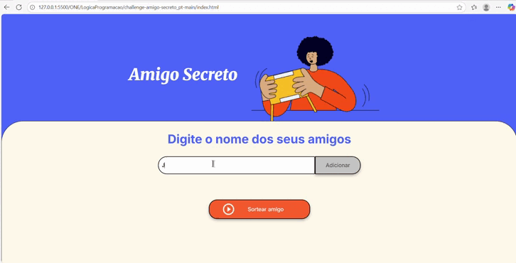

# 🎁 Amigo Secreto

Uma aplicação simples e divertida para sortear amigos secretos de forma aleatória!

## ✨ Funcionalidades

- ✅ Adicionar nomes à lista de amigos secretos.
- ✅ Validação de entradas vazias ou duplicadas.
- ✅ Visualização da lista de amigos adicionados.
- ✅ Sorteio aleatório de um amigo da lista.
- ✅ Limpeza automática da lista após o sorteio.

## 💻 Tecnologias

- HTML
- CSS
- JavaScript

## 🚀 Como usar

1. **Clone ou baixe este repositório.**
2. Abra o arquivo `index.html` em um navegador moderno.
3. No campo de texto, digite o nome de um amigo e clique em **"Adicionar"**.
4. Repita até adicionar todos os participantes.
5. Clique em **"Sortear Amigo"** para escolher aleatoriamente um nome da lista.
6. O resultado será exibido na tela e a lista será resetada automaticamente.

## 🧪 Exemplo de uso

## 📝 Regras do Sorteio

- É necessário **pelo menos 2 nomes** para realizar o sorteio.
- Nomes duplicados não são permitidos.
- O sorteio seleciona **um único nome aleatoriamente** da lista.
